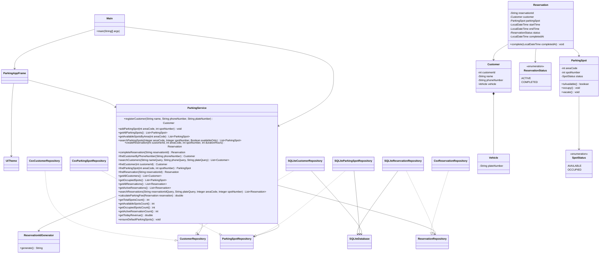

# ParkingApp

ParkingApp is now a desktop parking management application built with Java 17, Maven, Swing, and SQLite. It provides a professional operator interface for managing customers, parking spots, reservations, occupancy, and daily revenue while keeping the original domain logic.

## What Changed

- Replaced the console-first workflow with a desktop UI
- Added a dashboard with occupancy and revenue metrics
- Split persistence from business logic through repository interfaces
- Moved storage from CSV files to a local SQLite database
- Preserved service-level tests and Maven execution

## User Interface

The application starts in a control-center style desktop window with four work areas:

- `Dashboard`: total spots, availability, occupied spots, active reservations, and today's revenue
- `Customers`: register customers and search by name or phone number
- `Parking Spots`: add spots and filter by area, spot number, availability, and quick area
- `Reservations`: create reservations, complete checkout, search reservations, and review reservation history

## Architecture

- `com.parkingapp.model`: domain objects and enums
- `com.parkingapp.service`: business rules and reporting
- `com.parkingapp.repository`: persistence contracts
- `com.parkingapp.repository.sqlite`: SQLite-backed repository implementations
- `com.parkingapp.repository.csv`: legacy CSV repository implementations kept in the repo but not used by default
- `com.parkingapp.ui`: Swing desktop interface and styling

## Run

```bash
mvn compile
mvn exec:java
```

## Test

```bash
mvn test
```

## Data Storage

Runtime data is stored in SQLite under:

- `data/parkingapp.db`

You can override the database path with:

```bash
mvn exec:java -Dparkingapp.db.path=data/custom-parking.db
```

`data/` is ignored by git so local operator data does not pollute the repository.

## Validation Rules

- Customer phone numbers must be exactly 10 digits and start with `07`
- The customer phone input only accepts digits and blocks entry beyond 10 characters
- Customer search currently filters by `name` and `phone number`

## Class Diagram



The PlantUML source is also available in `docs/class-diagram.puml`.

## License

This project is licensed under the MIT License. See the [LICENSE](LICENSE) file for details.
______________________________________
Author
Fadi Yosef
